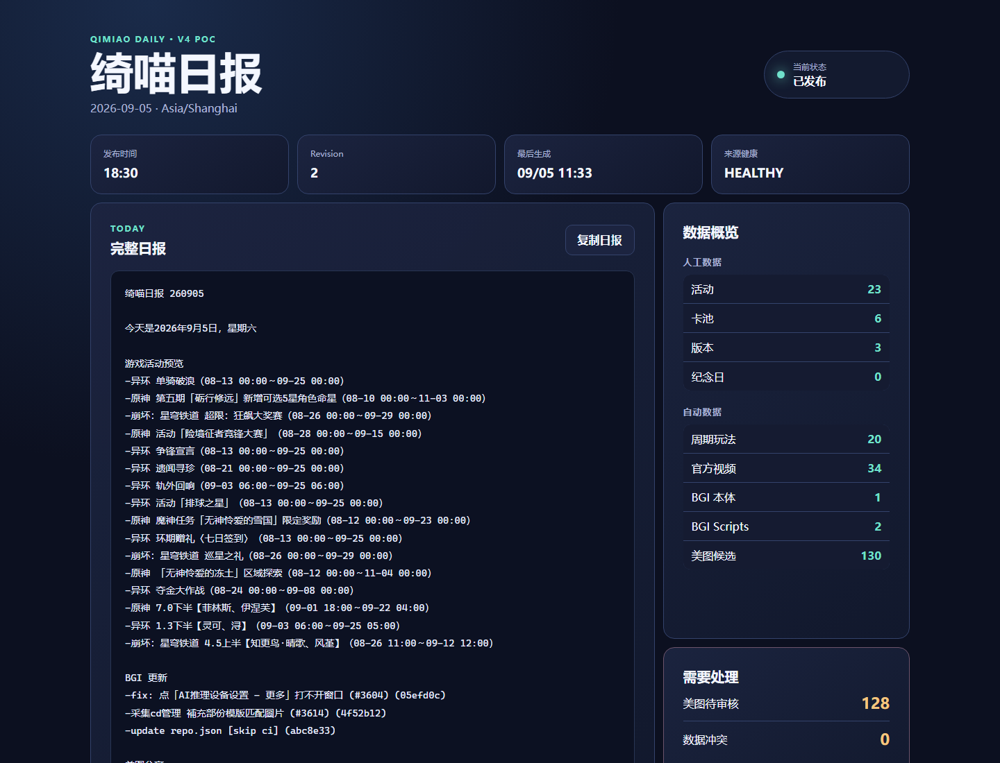

# V4-A Proof-of-Concept Result

Date: 2026-09-05  
Result: **LOCAL POC PASS / GITHUB AND QQ INTEGRATION BLOCKED_BY_USER**

## What passed

1. The read-only V3 SQLite exporter produced schema-backed JSON for activities, banners, versions, endgame rules and overrides, birthdays, anniversaries, custom calendar events, artwork metadata, official videos, and BGI commits.
2. `validate` accepted the exported manual data with zero issues.
3. The existing endgame rule engine produced 20 current/next occurrences while preserving independent anchors and `DATE_ONLY` semantics.
4. The reused Chinese calendar engine plus manual events produced 196 calendar records for 2026, including solar terms, traditional festivals, birthdays, anniversaries, and eligible custom events.
5. A real GitHub API collection obtained 1 BetterGI main commit and 2 BetterGI Scripts commits; both providers reported `HEALTHY`.
6. Report revision 1 was auto-locked and published in DRY_RUN mode. A second ordinary publish attempt exited with code 1 because of the idempotency guard.
7. Forced republication created and published revision 2 in DRY_RUN mode while retaining revision 1 and both append-only attempts.
8. A newer revision 3 was generated after publication; the dashboard and publish path still resolve immutable locked revision 2 rather than drifting to revision 3.
9. Production mode exited with code 1 and `BLOCKED_BY_USER`; no QQ request was made.
10. Seven workflow YAML files parsed successfully. The V4 artifact/Pages secret scan found no credential-like values.
11. The full solution passed **353 tests** and the Release build completed with **0 warnings / 0 errors**.

## Evidence

- Locked manifest: `reports/2026-09-05/manifest.json`
- Immutable revisions: `reports/2026-09-05/revisions/001.json`, `002.json`, and `003.json`
- Append-only dry-run log: `publish-log/2026-09-05.json`
- Dashboard payload: `web/data/dashboard.json`
- Rendered Pages screenshot: `docs/v4/evidence/pages-dashboard.png`

## Data migration totals

| Dataset | Count |
| --- | ---: |
| Activities | 23 |
| Banners | 6 |
| Versions | 3 |
| Endgame rules | 9 |
| Endgame overrides | 0 |
| Birthdays | 164 |
| Anniversary table rows | 0 |
| Legacy calendar events | 33 |
| Artwork metadata | 130 |
| Official video/preview rows | 34 |
| Existing BGI commit rows | 23 |

All 33 legacy calendar events are disabled `GAME` rows. They remain in `data/calendar-events.json` for reconciliation and are deliberately excluded from generated calendar/report output.

## Not yet proven on GitHub

This folder is not currently a Git repository and no target GitHub repository was provided. Therefore the workflow definitions and static Pages build were validated locally, but `workflow_dispatch`, hosted-runner scheduling, repository pushes, and Pages deployment have not executed on GitHub. They remain `BLOCKED_BY_USER` until a repository is selected and pushed.

Real QQ posting is also `BLOCKED_BY_USER` until an approved bot, test channel/forum identifiers, and Actions Environment secrets are supplied. Pixiv and official-video hosted-runner stability still require a multi-day observation window.
